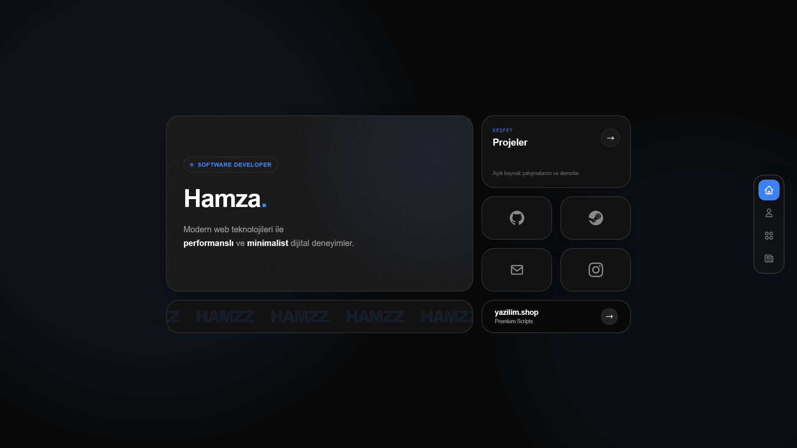

# Hamzzkkaya Portfolio



Bu proje, modern web teknolojileri kullanılarak geliştirilmiş, yüksek performanslı ve minimalist bir kişisel portfolyo web sitesidir.
**Google DeepMind'ın Gemini 3 Pro** modeli ile "Vibe Coding" metodolojisi kullanılarak geliştirilmiştir.

## 🌟 Özellikler

*   **⚡ Ultra Hızlı:** Backend için **Bun** ve **ElysiaJS** kullanıldı.
*   **🎨 Modern Arayüz:** **React 19** ve **TailwindCSS 4** ile şık, karanlık mod (dark mode) tasarımı.
*   **✨ Akıcı Animasyonlar:** **Framer Motion** ile sayfa geçişleri ve mikro etkileşimler.
*   **📝 Özel Markdown Motoru:** Blog ve Projeler için sıfırdan yazılmış; tablo, spoiler, video ve özel bileşenleri destekleyen Markdown işleyici.
*   **📱 Tam Duyarlı (Responsive):** Mobilden masaüstüne kusursuz görünüm.
*   **🔄 SPA (Single Page Application):** Gelişmiş client-side routing.

## 🛠️ Teknoloji Yığını (Tech Stack)

Bu proje en güncel ve performans odaklı teknolojiler seçilerek oluşturuldu:

*   **Runtime:** [Bun](https://bun.sh) (Node.js alternatifi, çok daha hızlı)
*   **Backend Framework:** [ElysiaJS](https://elysiajs.com) (Bun üzerinde çalışan yüksek performanslı framework)
*   **Frontend Library:** [React 19](https://react.dev)
*   **Styling:** [TailwindCSS 4](https://tailwindcss.com) (Alpha/Beta sürümü ile en yeni özellikler)
*   **Animations:** [Framer Motion](https://www.framer.com/motion/)
*   **Bundler:** Bun'ın dahili bundler'ı.

## 🚀 Kurulum ve Çalıştırma

Bu projeyi yerel ortamınızda çalıştırmak için bilgisayarınızda **Bun** kurulu olmalıdır.

1.  **Projeyi Klonlayın:**
    ```bash
    git clone https://github.com/hamzzkkaya/portfolio.git
    cd portfolio
    ```

2.  **Bağımlılıkları Yükleyin:**
    ```bash
    bun install
    ```

3.  **Geliştirme Sunucusunu Başlatın:**
    ```bash
    bun run dev
    ```
    Tarayıcınızda `http://localhost:3000` adresine giderek siteyi görüntüleyebilirsiniz.

4.  **Production Build (Canlıya Alma):**
    ```bash
    bun run build
    bun start
    ```

## 📂 Proje Yapısı

*   `src/index.ts`: Elysia sunucu konfigürasyonu ve backend entry point.
*   `src/client`: React frontend kodları.
    *   `src/client/pages`: Sayfa bileşenleri (Home, About, Projects, Blog).
    *   `src/client/components`: Tekrar kullanılabilir bileşenler (CustomMarkdown vb.).
    *   `src/client/utils`: Veri çekme ve yardımcı fonksiyonlar.
*   `public/data`: Site içeriğini barındıran JSON ve Markdown dosyaları (CMS mantığı).

## 📄 Lisans ve Kullanım (License)

Bu proje **MIT Lisansı** ile lisanslanmıştır. Kodları inceleyebilir, parçalar alabilir veya projenizde kullanabilirsiniz.

**⚠️ ÖNEMLİ NOT:**
Projenin **kaynak kodu** açık ve özgür olsa da;
*   **İçerik:** (Biyografim, Proje görsellerim, Blog yazılarım)
*   **Tasarım Kimliği:** (Kişisel markam)

bana aittir. Projeyi kendi portfolyonuz olarak kullanmak isterseniz, lütfen **içeriği, renk paletini ve kişisel bilgileri değiştirerek** kendinize özgü hale getirin. Projeyi "olduğu gibi" (clone) kopyalayıp yayına almanız etik değildir.

## 🤖 Vibe Coding & Gemini

Bu proje, kodlama sürecini daha akışkan ve yaratıcı hale getiren **"Vibe Coding"** yaklaşımıyla hayata geçirildi. 
Tüm mimari kararlar, kod yazımı ve hata ayıklama süreçlerinde **Gemini 3 Pro** yapay zeka asistanından yoğun destek alındı. AI ve insan işbirliğinin (Pair Programming) güçlü bir örneğidir.

---

**Geliştirici:** [Hamza](https://github.com/hamzzkkaya)
